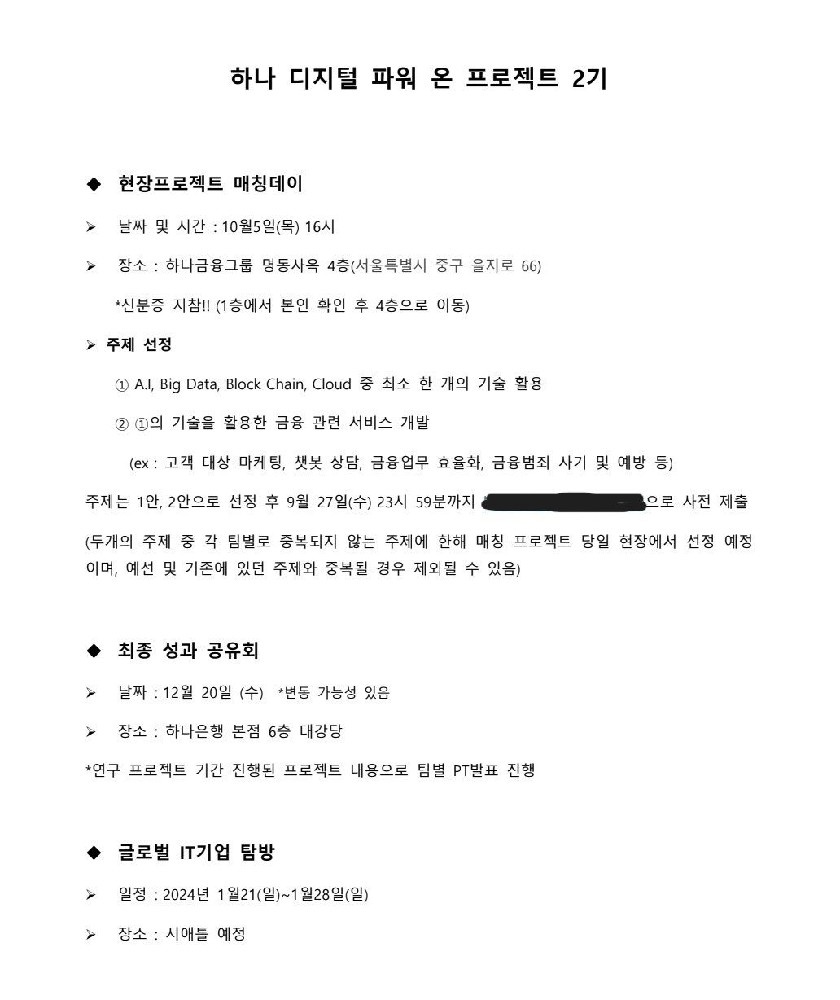
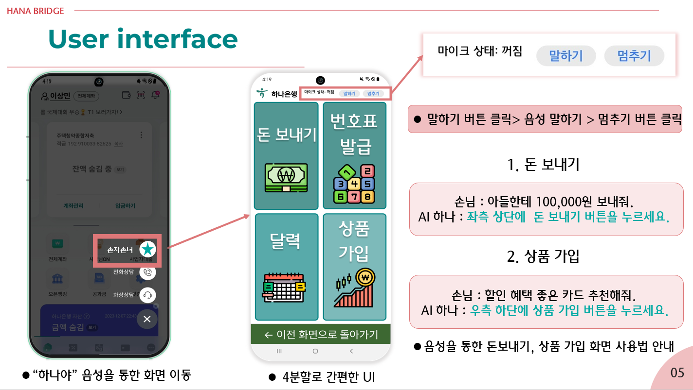
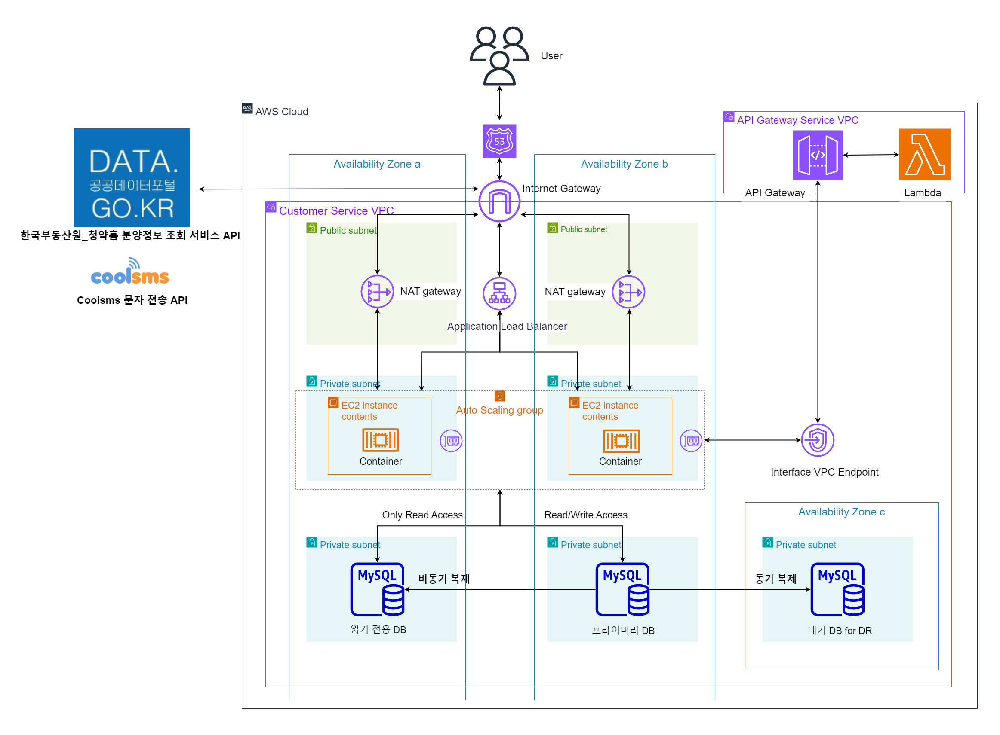

# 하나 디지털 파워 온 프로젝트 최종 성과 공유 프로젝트 백엔드 레포

- 진행 기간: 2023년 10월 5일 ~ 2023년 12월 20일
- 개발 인원: 백엔드 1명

## 요구사항

- 클라우드를 사용한 금융 관련 서비스 개발

## 서비스 소개

 

- 대표적 디지털 소외 계층인 고령층을 위한 금융 서비스 개발
    - 고객의 음성을 인식하여 고객이 원하는 서비스의 방법을 안내해주는 애플리케이션
    - 돈 보내기(송금)와 상품 가입에 음성을 안내해 주는 서비스

 

- 오픈 API를 사용하여 청약 정보 제공
  - 캘린더에 청약 정보를 제공해준다.

## 서비스 기능

- 회원가입/로그인
  - Spring Security와 Json Web Token(Jwt)를 사용한 인증 방식 사용

- 송금

- 상품 가입
  - 등록된 상품을 조회

- 달력
  - 오픈 API를 사용하여 가져온 청약 정보를 제공
  - 청약 데이터가 있는 날짜를 캘린더에 표시

- Coolsms API를 사용한 문자 전송
  - 송금 결과를 문자로 전송
  - 상품에 대한 추가적인 정보를 문자로 전송

- 음성 인식
  - 등록한 키워드를 인식하여 DB에 저장된 안내를 서비스

## Server Cloud Architecture

## 😎 Git Commit Convention

### Commit Type
- feat : 새로운 기능을 추가한 경우
- fix : 버그를 고친 경우
- docs : 문서를 수정한 경우
- test : 테스트 추가, 테스트 리팩토링
- chore : 빌드 업무 수정, 패키지 매니저 수정
- style : 코드 포맷팅, 세미콜론 누락, 코드 변경이 없는 경우
- refactor : 프로덕션 코드 리팩토링
- comment : 필요한 주석 추가 및 변경
- !BREAKING CHANGE : 커다란 API의 수정
- !HOTFIX : 급하게 치명적인 버그를 고치는 경우
- rename : 파일/폴더를 수정 또는 옮기는 경우
- remove : 파일을 삭제한 경우

